[](https://cplusplus.com/)

[](https://github.com/MatiasSagastume/tp-grupal-template/actions/workflows/pre-commit.yml)
[](https://github.com/MatiasSagastume/tp-grupal-template/actions/workflows/cmake-build-test.yml)
# Counter-Strike 2D

## Tabla de Contenidos
- [Integrantes](#integrantes)
- [Descripción](#descripción)
- [Instalación](#instalación)
- [Compilación](#compilación)
- [Ejecución](#ejecución)
- [Testing](#testing)
- [Manual del Usuario](#manual-del-usuario-counter-strike-2d)
  - [Introducción](#introducción)
  - [Requisitos del Sistema](#requisitos-del-sistema)
  - [Instalación](#instalación)
  - [Configuración](#configuración)
  - [Ejecución del juego](#ejecución-del-juego)
  - [Cómo se juega](#cómo-se-juega)
  - [Controles](#controles)
  - [Estructura de Archivos](#estructura-de-archivos)
  - [Ejemplo de uso](#ejemplo-de-uso)
- [Uso de Bibliotecas externas](#uso-de-bibliotecas-externas)
- [Licencia](#licencia)
  
## Integrantes

- [Manuel Herrera Esteban](https://github.com/Manuuherrera)
- [Carlos Matias Sagastume](https://github.com/MatiasSagastume)
- [Martín Alejandro Estrada Saavedra](https://github.com/martinSaav)
  
## Descripción
Juego multijugador 2D por rondas inspirado en el clásico Counter-Strike 1.6. Este juego fue desarrollado en C++ como parte del trabajo práctico final de la materia Taller de Programación I (FIUBA).


## Compilación
Para compilar el proyecto, se debe ejecutar el siguiente comando en la terminal:

```bash
make compile-debug
```

## Ejecución

Entrar a la carpeta build
```bash
   cd build
```

### Server
```bash
   ./server <port> <server_config_file>
```

### Cliente
```bash
   ./client <hostname> <port>
```

## Testing
Para ejecutar los tests, se debe ejecutar el siguiente comando en la terminal:

```bash
   make run-tests
```

## Manual del Usuario Counter Strike 2D

### Introducción

El juego consiste en una batalla armada entre dos bandos, donde los terroristas querrán plantar una bomba para ganar la partida, mientras que los anti-terroristas harán lo posible para impedirlo. La partida terminará luego de jugadas diez ronda (configurable). Cada ronda finaliza cuando todos los integrantes de un bando hayan sido eliminados, cuando los terroristas planten la bomba y ésta explote luego de un tiempo, o luego de que los anti-terroristas desactiven dicha bomba.

---

### Requisitos del Sistema

- **Sistema operativo compatible:** Ubuntu 24.04
- **Dependencias necesarias:** *(se instalan automáticamente con el instalador)*
  - gcc / g++ (C++20)
  - cmake
  - make
  - SDL2
  - SDL2\_image
  - SDL2\_mixer
  - qt6-base-dev
  - yaml-cpp

---

### Instalación

#### 1. Obtener el instalador


#### Opción A - Descargar el instalador
1. Ir a la pagina web del proyecto: [Counter-Strike 2D](https://martinsaav.github.io/Counter-Strike-2D-Website/)
2. Hacer click en el botón "Descargar instalador (.sh)" 
3. Guardar el archivo `install.sh` en una carpeta de tu elección

#### Opción B - Clonar el repositorio (requiere git)

```bash
git clone https://github.com/martinSaav/counter-strike-2D
cd counter-strike-2D
```

#### 2. Ejecutar el instalador

```bash
chmod +x install.sh
sudo ./install.sh
```

Esto realiza:

- Instalación de dependencias
- Compilación del proyecto
- Ejecución de tests
- Instalación de binarios en `/usr/bin`
- Instalación de assets en `/var/cs2d`
- Instalación de configuración en `/etc/cs2d`
- Accesos directos a `~/Desktop/client.sh` y `~/Desktop/server.sh`

---

### Configuración

El archivo principal de configuración es:

```
/etc/cs2d/server_config.yaml
```

Podés modificar:

- Vida y daño de jugadores
- Municiones
- Tiempos de preparación y rondas
- Opacidad del cono de visión
- Ángulo de visión

---

### Ejecución del juego

Una vez instalado, encontrás dos archivos en tu escritorio:

- `client.sh` para lanzar el cliente
- `server.sh` para lanzar el servidor

#### Desde una terminal:

Estar en el escritorio o en la carpeta del proyecto

##### Levantar el servidor

```bash
./server.sh
```
> Una opción para jugar en la red es abrir el puerto 8080 en el router y usar la IP pública del servidor (En algunas ocaciones, aunque el puerto esté abierto, puede que no funcione por temas de tu proveedor de internet)

##### Ejecutar el cliente

```bash
./client.sh
```

> Cambiá `localhost` por la IP del servidor si jugás en red.

---

### Cómo se juega

#### 1. Iniciar partida

- Ingresá tu nombre de usuario
- Elegí o creá una partida
- Elegí equipo y skin
- Esperá a que todos estén listos y comience la partida o esperá a que el creador inicie la partida.

#### 2. Objetivos del juego

- **Terroristas:** plantar y defender la bomba
- **Antiterroristas:** evitar la plantación o desactivarla

#### 3. Rondas
- Al comienzo de cada ronda, los jugadores tienen un tiempo de preparación para comprar armas y equipamiento.
- Luego, comienza la ronda donde los terroristas intentarán plantar la bomba en una de las zonas designadas, mientras que los antiterroristas intentarán impedirlo.

#### 4. Fin de ronda

- Eliminación del equipo contrario
- La bomba explota o es desactivada

---

### ⌨️ Controles

- `W`: Mover hacia arriba
- `A`: Mover hacia la izquierda
- `S`: Mover hacia abajo
- `D`: Mover hacia la derecha
- `Click izquierdo`: Disparar
- `1`: Cuchillo
- `2`: Arma primaria
- `3`: Arma secundaria
- `4`: Bomba (terroristas)
- `E`: Agarrar arma del suelo
- `R`: Recargar
- `Click izquierdo sobre zona de bomba`: Plantar la bomba (terroristas)
- `F`: Desactivar bomba (antiterroristas)
- `Q`: Salir del juego

---

### Estructura de Archivos

- `/usr/bin/taller_client` y `taller_server`: ejecutables
- `/var/cs2d/`: recursos (imágenes, sonidos)
- `/etc/cs2d/server_config.yaml`: configuración

---

### Ejemplo de uso

Primero nos situamos en el escritorio donde se encuentran los accesos directos
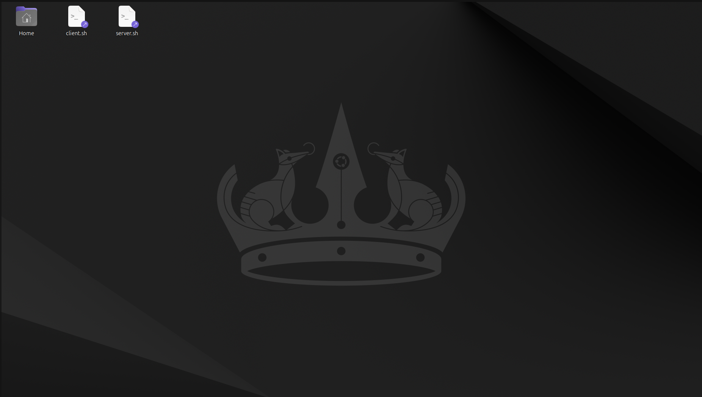

Luego abrimos una terminal y ejecutamos el servidor
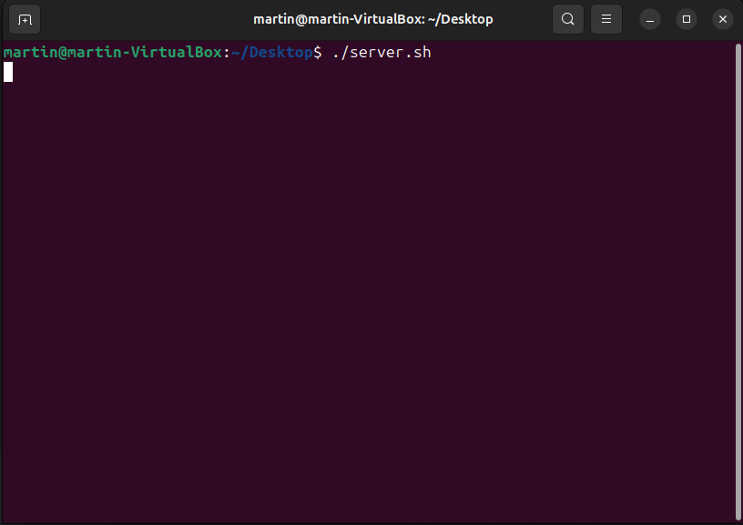

Después de iniciar el servidor, abrimos otro terminal y ejecutamos el cliente
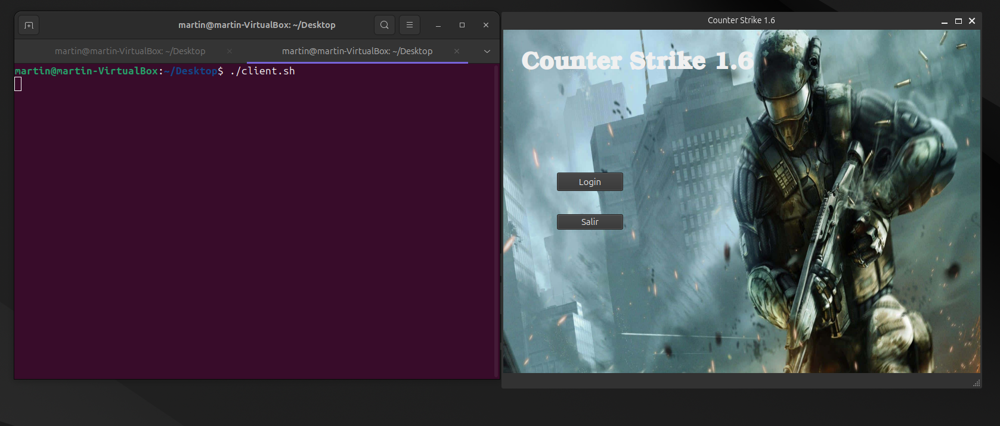

Iniciamos sesión con un nombre de usuario
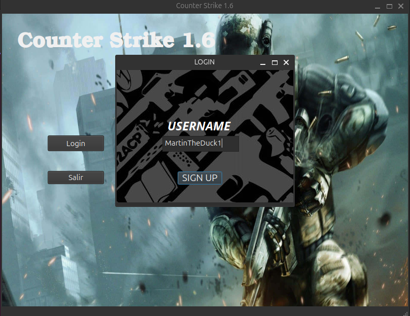

En el menu principal, podemos crear o unirse a una partida
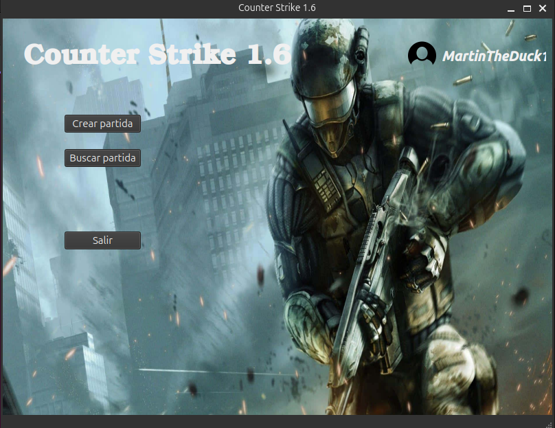

Creamos una partida, eligiendo el nombre de la partida y el mapa
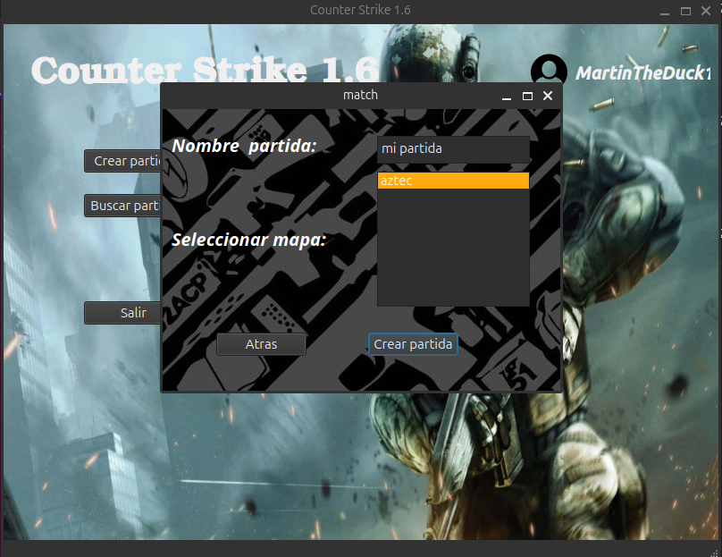

Una vez creada la partida, podemos elegir el equipo, la skin y esperamos a que todos los jugadores estén listos
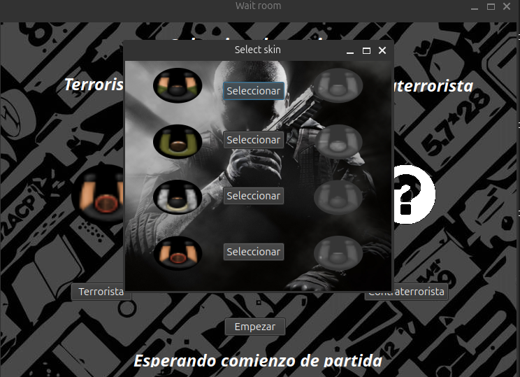

Tu amigo busca partidas y se une a la partida que creaste
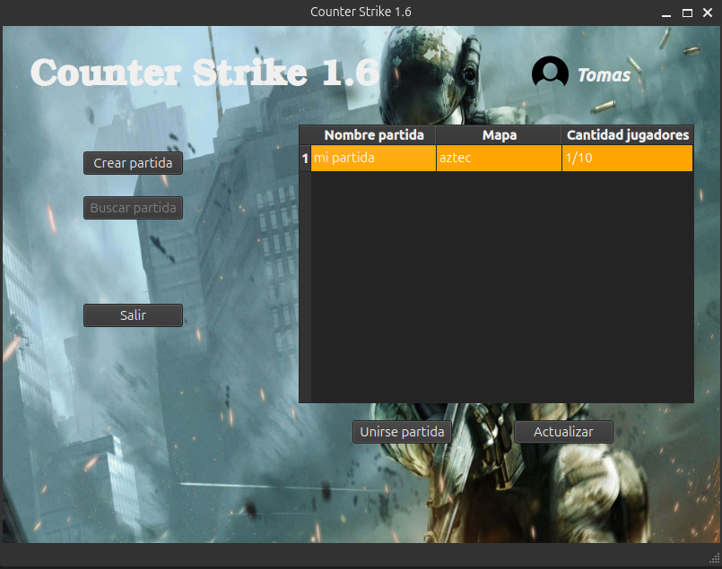

Comienza la partida
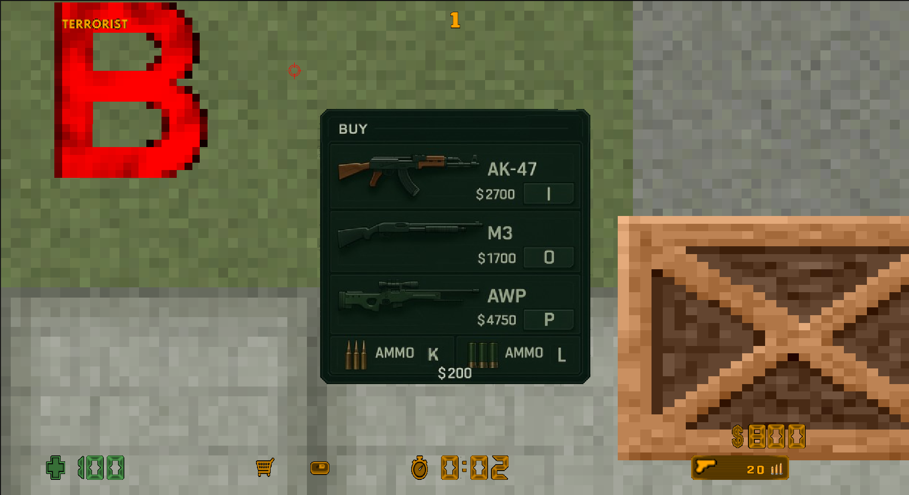

Comienza la ronda, los terroristas deben plantar la bomba y los antiterroristas deben evitarlo
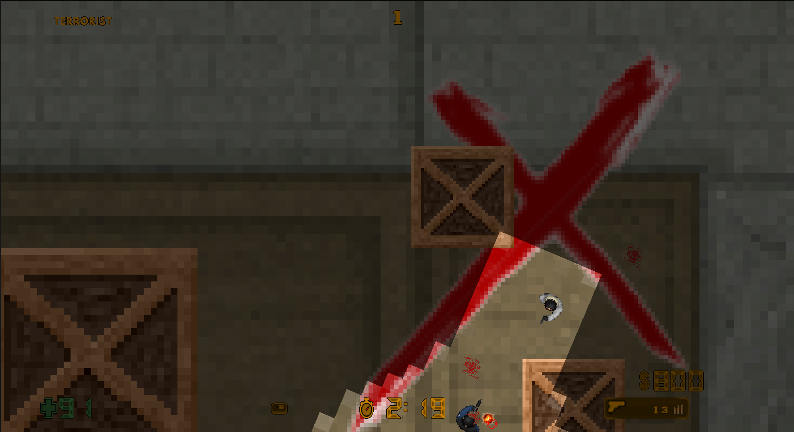

Después de un enfrentamiento, el equipo terrorista planta la bomba pero muere a manos del equipo antiterrorista
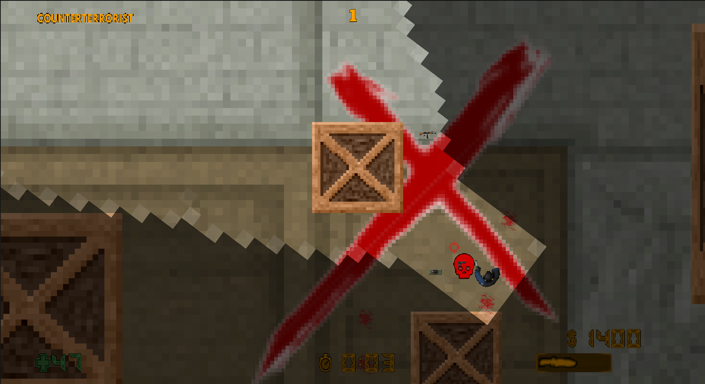

Pero el equipo antiterrorista no logra desactivarla a tiempo y explota
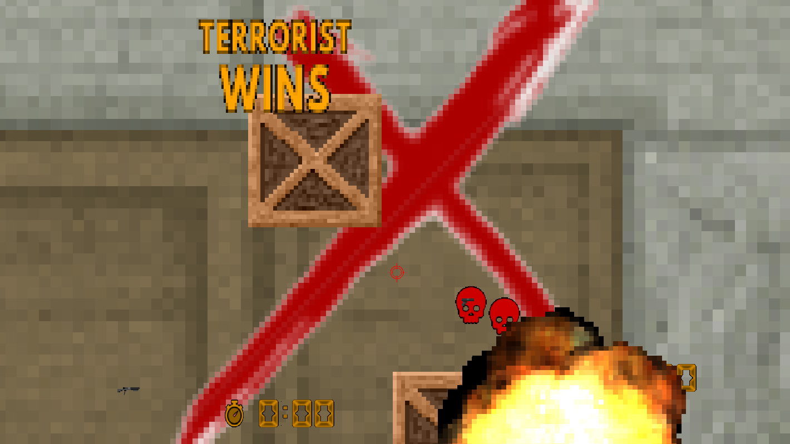


> Si tenés dudas, sugerencias o encontraste errores, comunicate con los desarrolladores a través de GitHub https://github.com/martinSaav/counter-strike-2D


## Uso de Bibliotecas externas

1. **Biblioteca de Sockets de la catedra Veiga**
- Autor: eldipa
- Licencia: GPL v2s
- Código fuente: https://github.com/eldipa/sockets-en-cpp

2. **Biblioteca de Threads de la catedra Veiga**
- Autor: eldipa
- Licencia: GPL v2s
- Código fuente: https://github.com/eldipa/hands-on-threads

## Licencia
Este proyecto está bajo la Licencia MIT. Para más detalles, consulta el archivo [LICENSE](LICENSE).
